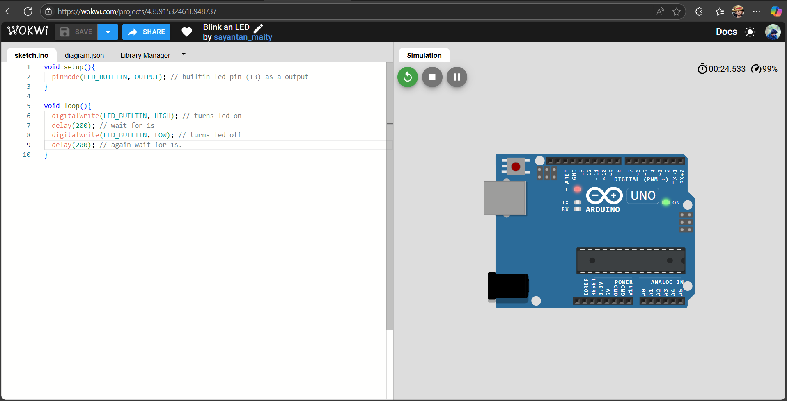

# 💡 LED Blink – Arduino Uno (Wokwi Simulation)

A beginner-level embedded systems project using Arduino Uno and Wokwi simulator.  
This project blinks the onboard LED (pin 13) with a delay of 1 second.

---

## 🔧 Tools Used
- [Wokwi Arduino Simulator](https://wokwi.com/)
- Arduino Uno
- C/C++ (Arduino syntax)

---

## 🧠 What I Learned
- Basics of embedded code structure (`setup()` and `loop()`)
- `digitalWrite()` and `delay()` functions
- Pin configuration and simulation on Wokwi

---

## ▶️ How to Run
1. Open this simulation on Wokwi
2. Click the **Start Simulation** button
3. The LED will blink ON/OFF every second

---

## 📷 Screenshot

---

## 📁 Files
- `blink.ino`: Arduino source code
- `README.md`: Project overview and instructions

---

## 📚 Future Upgrades
- Add multiple LEDs
- Control blinking with a button
- Build Morse Code LED blinker
